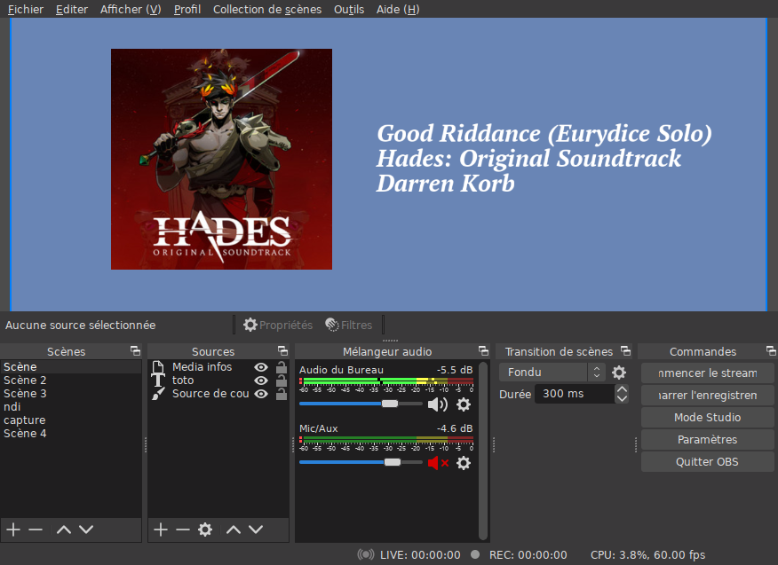

# obs_media_info

This project is an attempt at making a [OBS Studio](https://obsproject.com/) plugin.

The plugin display the current playing track info (title, album, artist) and artwork.

Data is collected though the [MPRIS 2](https://specifications.freedesktop.org/mpris-spec/latest/) or [Windows.Media.Control](https://docs.microsoft.com/en-us/uwp/api/windows.media.control?view=winrt-20348) interfaces so a lot of players should be supported (VLC, Spotify, Firefox, ...).

## Screenshot



## Windows
Get Latest dll from the [release tab](https://github.com/rmoalic/obs_media_info_plugin/releases).

### Build

* Get a copy of `obs.lib` and `w32-pthreads.lib`. You can get them from building the obs source code. Or by using the `lib_from_dll.ps1` PowerShell script on `obs.dll` and `w32-pthreads.dll` from your obs installation.

From the MSVC console (important):
``` powershell
powershell
. ./lib_from_dll.ps1
New-LibFromDll obs.dll
New-LibFromDll w32-pthreads.dll

```

* Download obs source code (for the headers) [here](https://github.com/obsproject/obs-studio/archive/refs/tags/27.0.1.zip). And unzip it to an `obs_studio` folder.


* Build the project
``` batch
build_msvc.bat
```

### Install

Place the `obs_media_plugin.dll` in the obs plugins directoty (`OBS-Studio-27.0.1-Full-x64\obs-plugins\64bit`).

## Linux
### Build

``` shell
$ apt update
$ apt install build-essential pkgconf # requiring make gcc pkgconf
$ apt install libdbus-1-dev libobs-dev

% make
```

### Install

Place the `obs_media_plugin.so` in the obs plugins directory.

``` shell
% mkdir -p $HOME/.config/obs-studio/plugins/obs_media_info/bin/64bit
% cp obs_media_plugin.so $HOME/.config/obs-studio/plugins/obs_media_info/bin/64bit/
or
% ln -s "$(pwd)/obs_media_info.so" $HOME/.config/obs-studio/plugins/obs_media_info/bin/64bit/obs_media_info.so
```

Or in the systemwide directory `/usr/share/obs/obs-plugins/` (distribution dependant. Archlinux: `/usr/lib/obs-plugins/`).

``` shell
$ cp obs_media_plugin.so /usr/share/obs/obs-plugins/
```

## TODO

- [ ] Not relying on ffmpeg to download images files (linux)
- [ ] Build using cmake like others obs plugins

## Note

* If you are using Firefox for media playback, make sure `media.hardwaremediakeys.enabled` is set to `true` (default)

